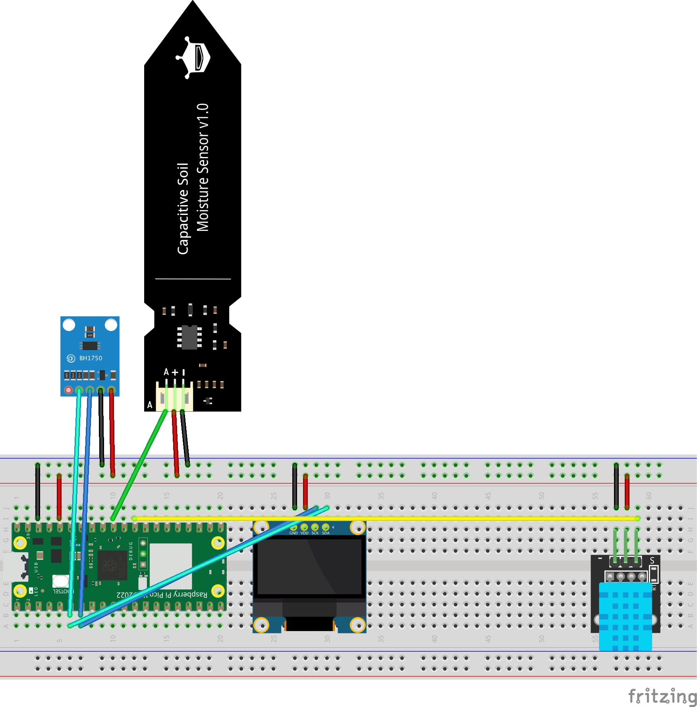
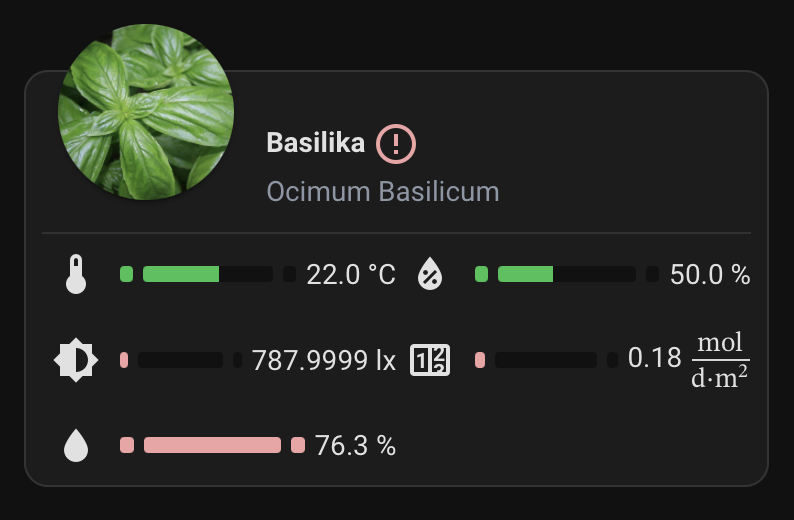
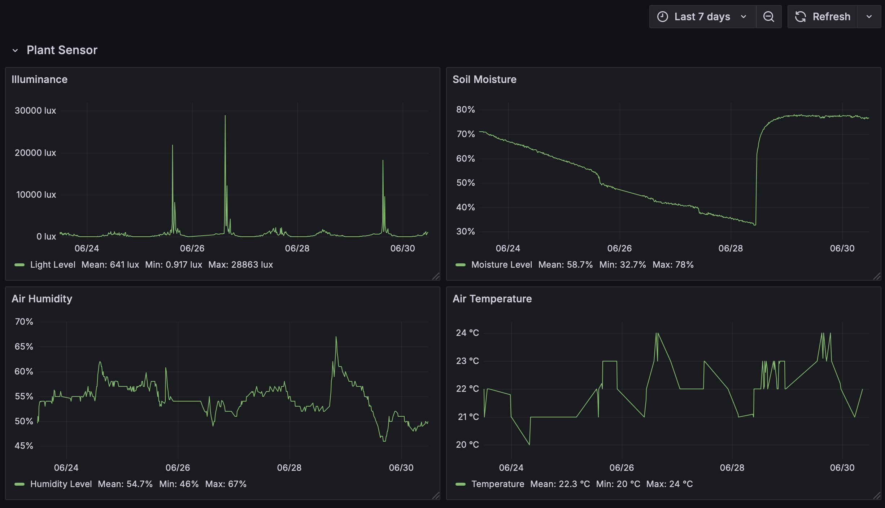

# Plant Monitor: Using Data to Care for My Green Babies 🌿


Project for 1DT305 IoT Summer Course, Linnaeus University (2025)

**Author**: Nils Olivier (no222jk)

---

## 1. Introduction: A New Plant Parent’s Journey 🌱

Becoming a plant parent has been one of the most rewarding (and surprisingly challenging) hobbies I’ve picked up recently. I quickly realized that plants aren’t just about watering them now and then—they each have their own little quirks and needs, like just the right amount of light, moisture, and temperature.

I kept wondering: how can I combine my love for tech with my new plant care journey? That’s when the idea for a Plant monitor was born. A handy little gadget that collects real-time environmental data to help me make smarter decisions. No more guessing games or hoping the plants survive.

> After all, making decisions without data is like driving blindfolded. You might get somewhere, but probably not where you want to be!

---

## 💡 Why I Built This: From Frustrations to Solutions

Common newbie mistakes I faced:

- Overwatering or underwatering due to unreliable soil moisture checks
- Uncertainty about sunlight exposure — too much or too little?
- Ignoring temperature and humidity swings that stress plants

With **Plant Monitor**, now I can:

- See exactly when soil moisture dips below safe levels
- Check if plants get enough light
- Monitor temperature and humidity to catch stress early
- Glance at an OLED screen for instant environmental updates
- Receive smart alerts and automate watering through my home system

No more guesswork — just confident plant care.

---

## The Tech Stack: My Plant Sensor’s Secret Sauce

### Hardware Platform

- **Raspberry Pi Pico WH**: The tiny brain running the show, juggling sensor reads and WiFi communication. I picked the Pico WH because it strikes a great balance between power, price, and ease of use. It comes with built-in WiFi, so I didn’t have to mess around with extra modules or complicated wiring. Plus, it runs MicroPython, which made coding and tweaking the sensor super approachable—even as a beginner.

### Sensors

- **DHT11**: Measures temperature and humidity reliably and simply.
- **BH1750**: Measures ambient light intensity, key for monitoring photosynthesis conditions.
- **Capacitive Soil Moisture Sensor (V1.2)**: Provides corrosion-resistant soil moisture readings.

>[!NOTE]
> I used the DHT11 because it was included in the electrokit starter kit (see Shopping List below), but it can easily be replaced with the more accurate variant DHT22 by changing "DHT11" with "DHT22" in the code. Also, a resistive soil moisture sensor might be cheaper but tend to give up after a few weeks from oxidation.

### Software and Communication Protocol

The project runs on **MicroPython**, a lightweight Python variant ideal for microcontrollers.

For wireless communication, I use MQTT over WiFi due to their complementary strengths:

- MQTT is a lightweight, reliable publish-subscribe protocol designed for constrained devices and unstable networks, ensuring smooth data transmission.
- WiFi offers good range and bandwidth within home environments but consumes more power than alternatives like LoRa or BLE. Since my sensor is mains-powered, WiFi’s power usage is acceptable.

### Data Handling and Transmission

Sensor data (temperature, humidity, light, soil moisture) is packaged into simple JSON messages and published via MQTT every 60 seconds. This interval balances timely updates with network load and power consumption. More frequent transmissions are possible but may impact battery life and network traffic.

### Display and User Interface

- **SSD1306 OLED Display**: Shows real-time sensor readings and status messages, making it easy to check plant health at a glance.
- **Home Assistant**: Automatically discovers sensors via MQTT, creating entities for each measurement. This allows me to visualize data, set up alerts, and build automations without writing complex code.

### Material Shopping List

| Component            | Image | Price (approx.) | Link      |
| -------------------- | ------ | --------------- | --------- |
| Raspberry pi Pico WH |  | 99 SEK          | [Electrokit](https://www.electrokit.com/raspberry-pi-pico-wh) |
| DHT11 Sensor         |  |49 SEK          | [Electrokit](https://www.electrokit.com/digital-temperatur-och-fuktsensor-dht11) |
| BH1750 Sensor        |  |64 SEK          | [Amazon](https://www.amazon.se/AZDelivery-GY-302-ljussensor-kompatibel-Raspberry/dp/B07TKWNGZ4/ref=sr_1_5?crid=1V0NPMIGGYUBQ&dib=eyJ2IjoiMSJ9.4d48pD1R3fEew6x0MFWLl_IXZfMhzH_ZV2Zm5eAFSD9Mx2PTLvyABOHUsueFtxyixyHbAGQ2CW7pqYSQjC5EynjrAf_lfZWofYZOMvjUwMGyy55uEplopONEfFbguXVqsGeMEGZSvqEfnWZq64U09Y-bf3Jrcgn8Ycdk5Al7Mu83USNMtOT-xiMKniAPjQGpHd__2lmnKYCJaA-gqvrPyPkoTDh_jsuMV-QPqjfJrEB0voQO4Xlx8YCAseCTJRLoBa806AcVBaR7Rzy-DjeDqleqzRxrYHQekiEv7WReF9s.a1AICh5F1qVroPsmaeKIEQv__6vm2AX4K2dSn1pRCzw&dib_tag=se&keywords=bh1750&qid=1750949215&sprefix=bh1750%2Caps%2C104&sr=8-5&th=1) |
| SSD1306 OLED Display |  |84 SEK          | [Amazon](https://www.amazon.se/AZDelivery-I2C-Skärm-kompatibel-Raspberry-inklusive/dp/B01L9GC470/ref=sr_1_1?crid=SS9FKA5ZUSJO&dib=eyJ2IjoiMSJ9.VaVe_G94JOqLqifyx76sV1fl6Cy41coSwGiy4AuRvILh3jxv__SeWw38WqUBTuwWb4KpFk7-mUWfRFRR9qVfJUTzyoFkkOVxEst32ietpZeUK_Knrf65VCrQavNXcPSnCdJfjWFJ7APZ3Fp-D8EuQd1Vpvtc0oGYGlV1i5Y18kVjn97C_TV1z9TpKjd5DlObB0ywrc1aJtzFJyC1zo5TI-Oqecub78gHd83vUU5syNEOcxvMSjO5qMq7xEkGkdlBKX0-EhAbBxSIcCGrsLxb8E3dUphdBhJxlManGyg9DxI.IxSxCbPv82M8AttRhmwo9Rb1_dC3SXGtBdTQ1_xOvVk&dib_tag=se&keywords=ssd1306&qid=1750949279&sprefix=ssd1306%2Caps%2C96&sr=8-1&th=1) |
| Capacitive Soil Moisture Sensor V1.2 |  |69 SEK | [Amazon](https://www.amazon.se/dp/B07HJ6N1S4/ref=twister_B08CF1TB9M?_encoding=UTF8&th=1) |
| Jumper Wires |  |- | - |
| Breadboard |  | 69 SEK | [Electrokit](https://www.electrokit.com/kopplingsdack-840-anslutningar) |

>[!TIP]
> Everything in this project from Elektrokit can be found as a starter kit for around 349 SEK, With other components like resistors, LEDs and other sensors. This kit is perfect for beginners and hobbyists who want to get started with microcontrollers and sensors. See [Electrokit Starter Kit](https://www.electrokit.com/lnu-starter).

---

## How It Works: A Peek Inside My Plant Sensor

### Initialization Magic

Every time the sensor boots up, it sets up communication channels:

- I2C bus for the BH1750 light sensor and the OLED screen
- GPIO pin for the DHT11 temperature and humidity sensor
- ADC channel for reading soil moisture voltage

I also built in checks to catch sensor failures early and keep the system running smoothly.

### Staying Connected

WiFi can be finicky sometimes, so my code tries up to 10 times to connect. Once online, the MQTT client hooks up to my broker with secure credentials.

If the network drops, no worries—the system automatically reconnects so I don’t have to babysit it.

### Gathering and Processing Data

Sensor reads happen every 6 seconds. To avoid noisy data, I collect raw readings into lists for one minute and then calculate averages.

For soil moisture, I translate raw analog values into a percentage based on calibrated dry and wet reference points (dry = 41,000 ADC units, wet = 18,000 ADC units). I calibrate these values by testing the sensor in dry and wet soil, then using those points to convert ADC readings into a percentage.

Here's a simplified code example showing how these concepts work in practice:

```python
from machine import Pin, SoftI2C, ADC
import dht
from bh1750 import BH1750
import time
import network
from umqtt.robust import MQTTClient

# Initialize sensors
def initialize_sensors():
    # I2C for BH1750 light sensor and OLED
    i2c = SoftI2C(scl=Pin(5), sda=Pin(4), freq=400000)
    
    # DHT11 for temperature and humidity
    dht_sensor = dht.DHT11(Pin(22))
    
    # BH1750 for light measurement
    light_sensor = BH1750(bus=i2c, addr=0x23)
    
    # Soil moisture sensor (analog)
    soil_moisture_adc = ADC(26)
    
    return dht_sensor, light_sensor, soil_moisture_adc

# Convert raw soil moisture to percentage
def get_soil_moisture_percent(raw_value, dry=41000, wet=18000):
    raw_value = max(min(raw_value, dry), wet)
    percent = int((dry - raw_value) * 100 / (dry - wet))
    return percent

# Read all sensors once
def read_sensors_once():
    # Read temperature and humidity
    dht_sensor.measure()
    temp = dht_sensor.temperature()
    hum = dht_sensor.humidity()
    
    # Read light level in lux
    lux = light_sensor.luminance(BH1750.ONCE_HIRES_1)
    
    # Read and convert soil moisture
    moisture_raw = soil_moisture_adc.read_u16()
    moisture = get_soil_moisture_percent(moisture_raw)
    
    return temp, hum, lux, moisture

# Main loop with averaging
temp_readings = []
hum_readings = []
lux_readings = []
moisture_readings = []

while True:
    # Read sensors every 6 seconds
    temp, hum, lux, moisture = read_sensors_once()
    
    # Store readings for averaging
    temp_readings.append(temp)
    hum_readings.append(hum)
    lux_readings.append(lux)
    moisture_readings.append(moisture)
    
    # Every 60 seconds, calculate averages and publish
    if len(temp_readings) >= 10:  # 10 readings * 6 seconds = 60 seconds
        avg_temp = sum(temp_readings) / len(temp_readings)
        avg_hum = sum(hum_readings) / len(hum_readings)
        avg_lux = sum(lux_readings) / len(lux_readings)
        avg_moisture = sum(moisture_readings) / len(moisture_readings)
        
        # Publish to MQTT
        mqtt_client.publish("homeassistant/sensor/pico_w_01/temperature/state", str(avg_temp))
        mqtt_client.publish("homeassistant/sensor/pico_w_01/humidity/state", str(avg_hum))
        mqtt_client.publish("homeassistant/sensor/pico_w_01/lux/state", str(avg_lux))
        mqtt_client.publish("homeassistant/sensor/pico_w_01/soil_moisture/state", str(avg_moisture))

        # Update OLED display
        update_oled(avg_temp, avg_hum, avg_lux, avg_moisture)
        
        # Clear readings for next cycle
        temp_readings.clear()
        hum_readings.clear()
        lux_readings.clear()
        moisture_readings.clear()
    
    time.sleep(6)
```

### Sharing and Showing Data

- The OLED updates every minute, showing current temperature, humidity, light level, and soil moisture in easy-to-read text.
- Sensor data and device status get published over MQTT with well-structured Home Assistant discovery topics. This means my smart home instantly knows what the sensor is measuring, its units, and whether it’s online or if a sensor is acting up.

### Keeping Things Clean

To avoid memory hiccups, garbage collection runs every 5 minutes to clear unused resources.

Plus, detailed logs help me track sensor and connection statuses over time.

### Flowchart

To visualize the flow of data and processes, I created a flowchart that outlines how everything connects and communicates:


---

## Setting Up: From Hardware to Smart Home Integration

### Wiring Up

Here’s how I hooked everything together:

| Sensor                 | Connection Details                      |
|------------------------|---------------------------------------|
| BH1750 & OLED          | I2C bus: SCL = GPIO5, SDA = GPIO4     |
| DHT11                  | Data pin connected to GPIO22           |
| Soil Moisture Sensor   | Analog output connected to ADC GPIO26  |
| Power                  | 3.3V and common ground from Pico       |

Check out the wiring diagram for a detailed visual:



>[!NOTE]
> I could not find a model for the Capactive Soil Moisture Sensor V1.2, but the wiring of 1.0 is the same.

>[!WARNING]
> Make sure to connect the sensors correctly! I found that while the choice of GPIO pins is flexible, I encountered issues with certain pins. The ones I used worked well for me. Make sure to double-check your connections!

>[!CAUTION]
> Don't forget to disconnect the power supply before making any changes to the wiring to avoid damaging the components.

### Software Setup

#### Prerequisites

- Raspberry Pi Pico WH with MicroPython firmware installed
- MQTT broker running on your network (like Mosquitto)
- Python IDE (VS Code with PyMakr extension or Thonny)

#### Installation Steps

1. **Clone this repository**:

   ```bash
   git clone https://github.com/F4de10/plant-monitor.git
   cd plant-monitor
   ```

2. **Flash MicroPython firmware** onto the Pico WH:
   - Download the latest MicroPython firmware for Pico W from [micropython.org](https://micropython.org/download/rp2-pico-w/)
   - Hold the BOOTSEL button while connecting the Pico to your computer
   - Copy the `.uf2` file to the RPI-RP2 drive

3. **Configure your settings**:
   - Create a `config.py` file in the root of the project directory if it doesn't exist.
   - Copy the provided `config_py.example` to `config.py`
   - Update the following in `config.py`:

     ```python
     WIFI_SSID = "your_wifi_name"
     WIFI_PASSWORD = "your_wifi_password"
     MQTT_BROKER = "192.168.1.100"  # Your MQTT broker IP
     MQTT_USERNAME = "your_mqtt_username"
     MQTT_PASSWORD = "your_mqtt_password"
     ```

   - You may change other settings to suit your needs, but the above are essential for connecting to WiFi and MQTT.

4. **Upload all files** to your Pico WH:
   - Using VS Code with PyMakr: Connect to device and upload the entire project folder
   - Using Thonny: Upload all `.py` files and the `lib/` directory
   - Make sure to preserve the directory structure, especially `lib/umqtt/`

5. **Run the script**:
   - Execute `main.py` on your Pico WH
   - Watch the console for initialization messages and sensor readings
   - The OLED display should show "Starting..." then live sensor data

#### Troubleshooting

**Common Issues:**

- **Import errors**: Ensure the `lib/` directory is uploaded with all files
- **WiFi connection fails**: Check SSID and password in `config.py`
- **MQTT connection fails**: Verify broker IP and credentials
- **Sensor readings show `--`**: Check wiring connections and power supply

**Debug Steps:**

1. Check console output for specific error messages
2. Verify all sensors are detected during initialization
3. Test individual sensor connections
4. Ensure 3.3V power is stable across all sensors

### Plugging Into Your Smart Home

Make sure you have an MQTT broker running on your network (Mosquitto is a great free option).

Home Assistant will auto-discover the sensors through MQTT and create entities for temperature, humidity, light, and soil moisture right away.

From there, you can build dashboards to visualize data or set up automations—like notifications when your plants need watering.

### My Home Assistant Setup: Smart Monitoring & Long-Term Insights

I run Home Assistant on a Raspberry Pi 5 with an SSD, ensuring fast and reliable performance for my smart home needs. The Plant Monitor integrates tightly with this setup, allowing real-time monitoring, alerts, and historical analysis. Here is how I structured it:

#### 1. MQTT Broker: The Communication Backbone

At the core, I use the [Mosquitto MQTT broker integration](https://www.home-assistant.io/integrations/mqtt/) in Home Assistant to handle all MQTT messages from the Plant Sensor. This broker receives sensor data (temperature, humidity, illuminance, soil moisture) and distributes it to Home Assistant entities for further processing and visualization.

#### 2. Real-Time Plant Care System with OpenPlantBook & Plant Card

To turn raw sensor data into meaningful plant care information, I use:

- **[openplantbook](https://github.com/Olen/home-assistant-openplantbook):** This integration imports detailed plant profiles from the [OpenPlantBook](https://open.plantbook.io) database, providing ideal ranges for temperature, humidity, light (including Daily Light Integral or DLI), and soil moisture specific to each plant species.
  
- **[Plant Card](https://github.com/Olen/homeassistant-plant):** This Home Assistant card displays plants on my dashboard with their current environmental conditions compared against the thresholds from OpenPlantBook.

Key features include:

- **Dynamic Threshold Checking:** Sensor values are continuously compared against optimal intervals. If any value (e.g., soil moisture or air temperature) falls outside the healthy range, the plant’s status changes to “problem,” clearly visible on the dashboard.
  
- **Daily Light Integral (DLI) Calculation:** The system calculates the DLI — the total amount of photosynthetically active light a plant receives during the day — from the illuminance sensor data. This metric helps determine if plants receive enough light overall, not just momentarily.
  
- **Automated Alerts & Automations:** When the plant status changes to “problem,” Home Assistant can trigger notifications on my phone or automate watering and lighting via connected devices.

This integration makes my plant care data actionable and accessible, moving far beyond simple sensor readings. I also added a [custom dashboard card](https://github.com/Olen/lovelace-flower-card) to visualize the plant data in a user-friendly way:



#### 3. Long-Term Time Series Storage with VictoriaMetrics

Home Assistant’s default SQLite database isn’t optimized for high-frequency sensor data over long periods. To overcome this, I use:

- **[VictoriaMetrics DB integration](https://github.com/VictoriaMetrics-Community/homeassistant-addon-victoriametrics):** A time series database optimized for IoT data storage, allowing me to store months or years of sensor data efficiently.

This setup ensures that no data gets lost and enables deep analysis of trends and seasonal changes affecting plant health.

#### 4. Interactive Visualization with Grafana

To make the stored data easy to explore and understand, I deployed:

- **[Grafana integration](https://github.com/hassio-addons/addon-grafana):** Connected directly to VictoriaMetrics, Grafana provides flexible dashboards with customizable time ranges (24 hours, 7 days, etc.).



---

## What’s Next?

This project is just the beginning. Here’s what I would add next:

- **A 3D-printed enclosure** to protect the hardware and make it look nicer on my plant shelf.
- **Battery power** so I can place sensors anywhere without worrying about cables.
- **Extra sensors** like CO₂, soil pH, or nutrients for even deeper insights.
- **Machine learning** to analyze data trends and predict plant stress or disease before I even see symptoms.

---

## Wrapping Up

Building this Plant Sensor taught me how accessible IoT can be for everyday problems. By combining affordable hardware with open protocols like MQTT, I created a tool tailored to my plants’ needs—and I hope it inspires others to do the same.

---

Happy planting and coding! 🌿
